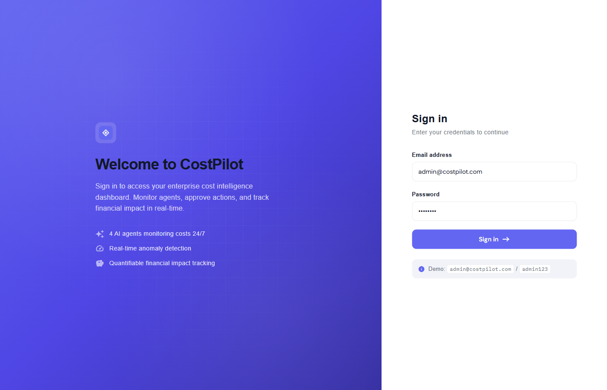
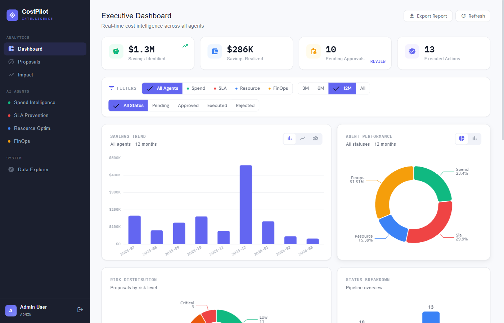
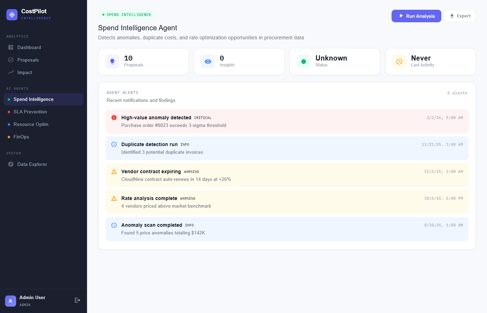
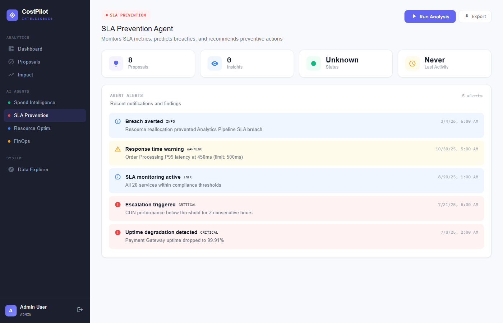
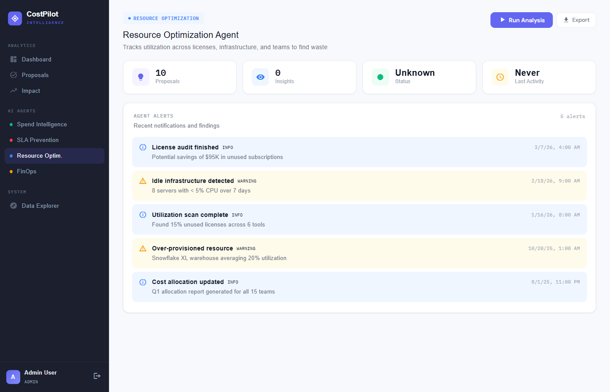
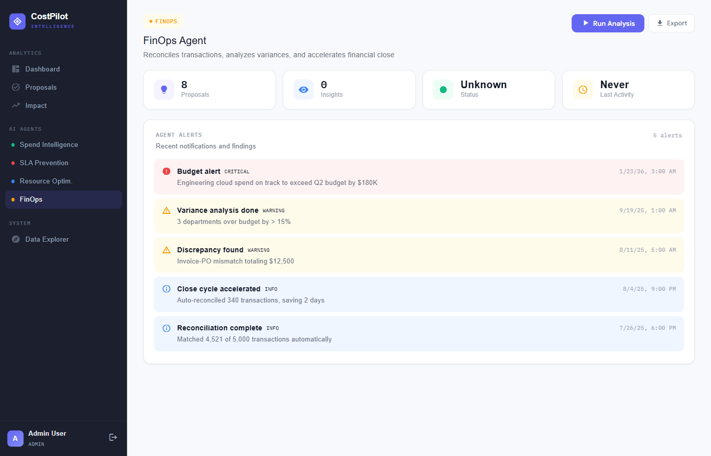
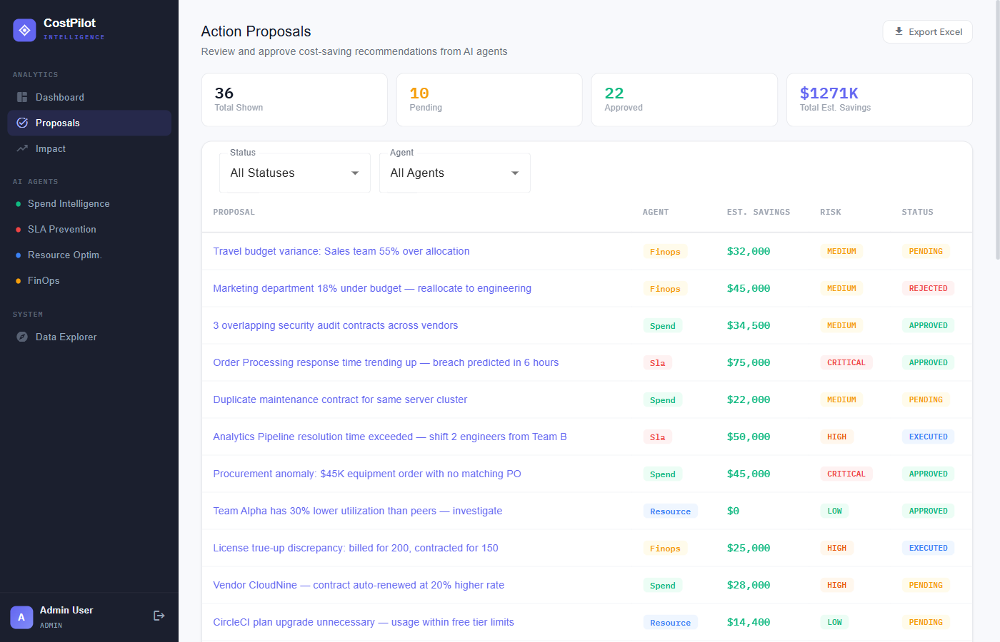
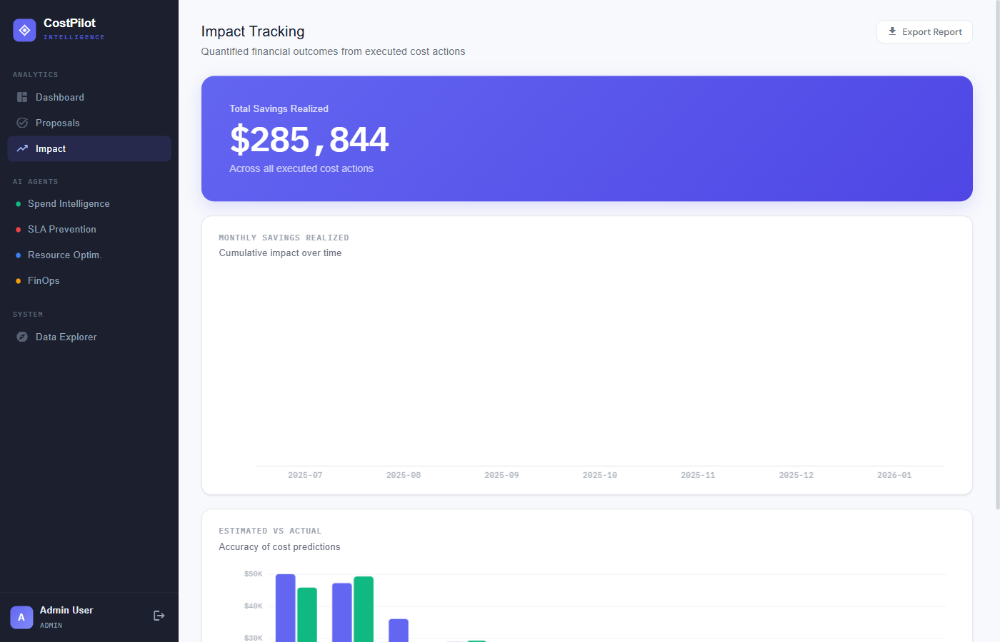
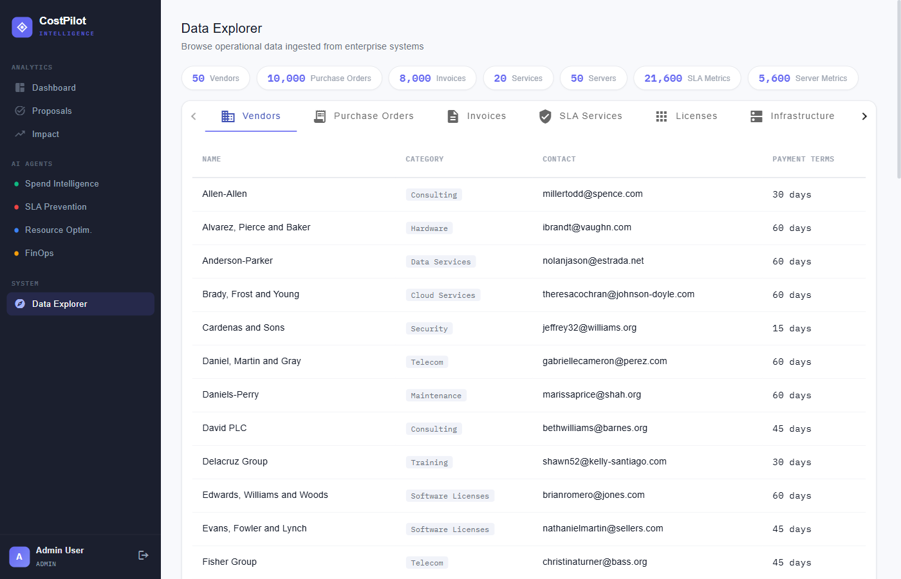
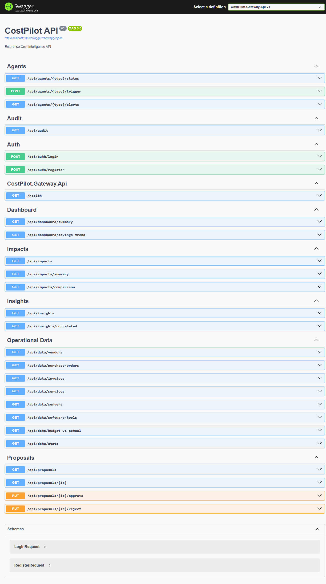

# CostPilot - Project Flow Document

## AI for Enterprise Cost Intelligence & Autonomous Action

---

## 1. Project Overview

CostPilot is an AI-powered enterprise cost intelligence platform that **goes beyond dashboards**. It continuously monitors enterprise operations data, identifies cost leakage and inefficiency patterns, and initiates corrective actions with **quantifiable financial impact**.

### Key Differentiators
- **4 Specialized AI Agents** that autonomously detect cost issues
- **Enterprise Approval Workflows** with human-in-the-loop before execution
- **Cross-Agent Correlation** that combines insights from multiple agents
- **Quantifiable Financial Impact** — every action shows estimated vs actual savings
- **46,000+ integrated data records** across procurement, SLA, resources, and finance

---

## 2. Architecture

```
                          +-------------------+
                          |  Angular Dashboard |
                          |    (Port 4200)     |
                          +--------+----------+
                                   |
                            HTTP / WebSocket (SignalR)
                                   |
                          +--------v----------+
                          |  .NET 8 Gateway    |
                          |    (Port 5000)     |
                          |  - JWT Auth        |
                          |  - Approval Engine |
                          |  - Correlation     |
                          |  - Auto-Execution  |
                          +----+--------+-----+
                               |        |
                      RabbitMQ |        | EF Core
                               |        |
              +----------------+        +--------+
              |                                  |
    +---------v-----------+            +---------v---------+
    |     RabbitMQ        |            |    PostgreSQL      |
    |   (Port 5672)       |            |    (Port 5432)     |
    |  Message Broker     |            |  46,000+ records   |
    +---------+-----------+            +-------------------+
              |
    +---------v--------------------------------------------+
    |                AI Agent Services                      |
    |  +----------+  +----------+  +----------+  +-------+ |
    |  |  Spend   |  |   SLA    |  | Resource |  | FinOps| |
    |  |  :8001   |  |  :8002   |  |  :8003   |  | :8004 | |
    |  +----------+  +----------+  +----------+  +-------+ |
    +------------------------------------------------------+
```

### Tech Stack
| Layer | Technology |
|-------|-----------|
| Frontend | Angular 17+, Angular Material, ECharts, SignalR |
| API Gateway | .NET 8, MassTransit, Entity Framework Core, JWT |
| AI Agents | Python 3.10+, CrewAI, FastAPI |
| Database | PostgreSQL 16 |
| Messaging | RabbitMQ 3.13 |
| Export | ExcelJS (formatted .xlsx reports) |

---

## 3. Detailed Application Flow

### Step 1: Authentication

Users access the platform at `http://localhost:4200` and are presented with the login page.

**Roles:**
- **Admin** — Full access, can approve/reject proposals, trigger agents
- **Approver** — Can approve/reject proposals
- **Viewer** — Read-only dashboard access

**Demo Credentials:**
- Admin: `admin@costpilot.com` / `admin123`
- Approver: `approver@costpilot.com` / `approver123`
- Viewer: `viewer@costpilot.com` / `viewer123`



**Flow:** User enters credentials -> .NET Gateway validates via BCrypt -> JWT token issued -> Stored in browser -> All API calls authenticated via Bearer token.

---

### Step 2: Executive Dashboard

After login, users see the Executive Dashboard — a real-time command center for enterprise cost intelligence.



**Components:**
1. **KPI Cards** — Total Savings Identified ($1.27M), Savings Realized ($286K), Pending Approvals (10), Executed Actions (13)
2. **Filter Bar** — Filter by Agent (Spend/SLA/Resource/FinOps), Time Period (3M/6M/12M/All), Status (Pending/Approved/Executed/Rejected)
3. **Savings Trend Chart** — Monthly bar/line/area chart (toggleable) showing savings identified over time
4. **Agent Performance** — Donut/bar chart (toggleable) showing contribution by each agent
5. **Risk Distribution** — Pie chart showing Low/Medium/High/Critical breakdown
6. **Status Breakdown** — Bar chart showing pipeline (Pending/Approved/Executed/Rejected)
7. **Agent Status** — Real-time health of all 4 agents with navigation links
8. **Top Findings** — Highest-impact proposals ranked by dollar value
9. **Recent Alerts** — Color-coded severity (Critical/Warning/Info)

**Real-time Updates:** SignalR WebSocket pushes new proposals, alerts, and correlated findings to the dashboard without page refresh.

---

### Step 3: AI Agent Analysis

Each agent runs on a configurable schedule (default: 5 minutes) or can be manually triggered. In demo mode, agents query the 46K+ seeded records using SQL. In AI mode, they use CrewAI with Claude to reason about the data.

#### 3a. Spend Intelligence Agent (Port 8001)



**What it detects:**
- Price anomalies (vendors charging >25% above average)
- Duplicate invoices (same vendor, same amount, within 30 days)
- Vendor rates above market benchmarks
- Overlapping contracts for similar services

**CrewAI Roles:**
- `AnomalyDetector` — Scans transactions for unusual patterns
- `DuplicateFinder` — Identifies duplicate invoices and overlapping contracts
- `RateOptimizer` — Compares vendor rates against market benchmarks

#### 3b. SLA Prevention Agent (Port 8002)



**What it detects:**
- Services approaching SLA breach (uptime below target)
- Response time degradation trends
- Penalty amounts at risk ($10K - $150K per breach)

**CrewAI Roles:**
- `SLAMonitor` — Tracks service metrics against thresholds
- `BreachPredictor` — Trend analysis to predict breaches before they happen
- `EscalationManager` — Recommends resource shifts and escalations

#### 3c. Resource Optimization Agent (Port 8003)



**What it detects:**
- Unused software licenses (tools with <60% utilization)
- Idle servers (CPU <10% for 7+ days)
- Over-provisioned infrastructure

**CrewAI Roles:**
- `UtilizationAnalyzer` — Tracks usage across licenses, servers, tools
- `ConsolidationPlanner` — Proposes consolidation actions
- `CostAllocator` — Attributes costs to teams for accountability

#### 3d. FinOps Agent (Port 8004)



**What it detects:**
- Budget variances >15% (department overspends)
- Unreconciled invoices
- Invoice-PO discrepancies

**CrewAI Roles:**
- `TransactionReconciler` — Matches expected vs actual transactions
- `VarianceAnalyst` — Budget vs actual with root-cause attribution
- `CloseAccelerator` — Automates reconciliation to speed financial close

---

### Step 4: Proposal Lifecycle (Approval Workflow)

This is the core enterprise workflow — agents detect issues, humans approve actions, system executes and measures impact.

```
Agent Detects Issue
        |
        v
Creates ActionProposal (status: PENDING)
        |
        v
Published to RabbitMQ --> Gateway Consumer receives
        |
        v
Persisted to PostgreSQL + Push to Dashboard via SignalR
        |
        v
Approver reviews in Proposals page
        |
   +----+----+
   |         |
   v         v
APPROVE    REJECT
   |         |
   v         |
Gateway publishes     Audit log entry
ProposalDecision      recorded
   |
   v
Auto-Execution Service picks up (after 30s delay)
   |
   v
Marks as EXECUTED + Records CostImpact
   |
   v
Financial impact visible in Impact Tracking
```



**Proposals Page Features:**
- Filterable by Status (Pending/Approved/Executed/Rejected) and Agent type
- Summary strip: Total shown, Pending count, Approved count, Total estimated savings
- Color-coded risk tags (Low=green, Medium=amber, High=orange, Critical=red)
- Color-coded status tags
- Click any proposal to see detail view with Approve/Reject buttons
- Export to formatted Excel (.xlsx)

---

### Step 5: Impact Tracking

After proposals are executed, their financial impact is measured and tracked.



**Features:**
- Hero KPI: Total Savings Realized (purple gradient card)
- Monthly Savings chart (area chart with trend line)
- Estimated vs Actual comparison (grouped bar chart)
- Variance analysis per executed proposal

**The Math (quantifiable impact):**
- Each proposal has an **Estimated Savings** (predicted by agent)
- After execution, **Actual Savings** is measured (75-110% of estimate, with variance)
- The system shows the **accuracy** of predictions via variance percentage

---

### Step 6: Cross-Agent Correlation

The Correlation Engine in the .NET Gateway detects when multiple agents identify related issues.

**How it works:**
1. Each agent publishes insights to a shared RabbitMQ exchange
2. Gateway's `InsightPublishedConsumer` receives every insight
3. `CorrelationEngine.TryCorrelateAsync()` checks:
   - Same entity_id from different agents within 1-hour window
   - Same entity_type with complementary insight types
4. If correlated: creates a `CorrelatedFinding` with combined impact
5. Confidence = max(individual) + 0.05 per additional corroborating insight (capped at 0.99)

**Example correlations:**
- **Spend + Resource**: "Vendor tool is overpriced AND underutilized — cancel and save $89K"
- **SLA + Resource**: "Service at breach risk AND idle capacity available — reallocate"
- **FinOps + Spend**: "Budget variance traced to vendor pricing spike"

---

### Step 7: Data Explorer

The Data Explorer provides deep visibility into the operational data that agents analyze, demonstrating data integration depth.



**7 Data Tabs:**
1. **Vendors** (50) — Name, category, contact, payment terms
2. **Purchase Orders** (10,000) — Vendor, item, quantity, price, total, date
3. **Invoices** (8,000) — Invoice #, vendor, amount, date, reconciled status
4. **SLA Services** (20) — Service name, uptime target, response time, resolution hours
5. **Software Licenses** (30) — Tool name, used/total licenses, utilization bar, annual cost + stacked bar chart
6. **Infrastructure** (50 servers) — Name, type, CPU%, memory%, monthly cost + horizontal bar chart
7. **Budget vs Actual** (768 entries) — Department, category, budget, actual, variance + grouped bar chart

**Embedded anomalies in the data:**
- 5% duplicate invoices
- 3 vendors priced 15-30% above market
- 15% unused software licenses
- 20% idle infrastructure (CPU <10%)
- Deliberate budget variances for agent detection

---

### Step 8: API Documentation

Full OpenAPI/Swagger documentation is available at `http://localhost:5000/swagger`.



**API Endpoint Groups:**
| Group | Endpoints | Description |
|-------|----------|-------------|
| `/api/auth` | POST login, POST register | JWT authentication |
| `/api/dashboard` | GET summary, GET savings-trend | Aggregated analytics |
| `/api/proposals` | GET list, GET detail, PUT approve, PUT reject | Proposal lifecycle |
| `/api/agents` | GET status, POST trigger, GET alerts | Agent management |
| `/api/insights` | GET list, GET correlated | Cross-agent intelligence |
| `/api/impacts` | GET list, GET summary, GET comparison | Financial tracking |
| `/api/data` | GET vendors, POs, invoices, services, servers, tools, budget, stats | Operational data |
| `/api/audit` | GET log | Audit trail |

---

## 4. Data Flow Diagram

```
Enterprise Data Sources (Simulated)
    |
    | Seeded into PostgreSQL (46K+ records)
    |
    +---> Procurement Data: 50 vendors, 10K POs, 8K invoices, 97 contracts
    +---> SLA Data: 20 services, 21.6K metric readings, 60 penalty schedules
    +---> Resource Data: 15 teams, 30 tools, 50 servers, 5.6K server metrics
    +---> Financial Data: 768 budget vs actual entries, 90 cost allocations
    |
    v
AI Agents Query Data (SQL in demo mode / CrewAI+Claude in AI mode)
    |
    +---> Spend Agent: finds price anomalies, duplicates, rate opportunities
    +---> SLA Agent: detects breach risks, predicts penalties
    +---> Resource Agent: identifies unused licenses, idle servers
    +---> FinOps Agent: spots budget variances, reconciliation gaps
    |
    v
Publish Findings to RabbitMQ
    |
    v
.NET Gateway Consumers receive messages
    |
    +---> Save to PostgreSQL (ActionProposals, AgentInsights, AgentAlerts)
    +---> Run Correlation Engine (cross-agent matching)
    +---> Push to Angular Dashboard via SignalR (real-time)
    |
    v
Dashboard displays findings -> User reviews -> Approves/Rejects
    |
    v
Auto-Execution Service runs approved proposals (after 30s)
    |
    v
Records CostImpact with actual savings
    |
    v
Impact Tracking shows estimated vs actual with variance
    |
    v
Export to formatted Excel report (.xlsx)
```

---

## 5. How to Run Locally

### Prerequisites
- PostgreSQL 16 running on port 5432
- RabbitMQ running on port 5672
- .NET 8 SDK
- Python 3.10+
- Node.js 18+

### Step-by-step

```bash
# 1. Create database
psql -U postgres -c "CREATE DATABASE costpilot;"

# 2. Run EF Core migrations
cd costpilot/gateway
dotnet ef database update --project src/CostPilot.Gateway.Infrastructure --startup-project src/CostPilot.Gateway.Api

# 3. Seed operational data (46K+ records)
cd costpilot/agents/seed
pip install psycopg2-binary faker
python seed_data.py

# 4. Seed dashboard demo data (proposals, alerts, insights)
python seed_dashboard.py

# 5. Install Python common library
cd costpilot/agents/common
pip install -e .

# 6. Start .NET Gateway (Terminal 1)
cd costpilot/gateway/src/CostPilot.Gateway.Api
dotnet run --urls="http://localhost:5000"

# 7. Start Angular Dashboard (Terminal 2)
cd costpilot/dashboard
npm install
npx ng serve --proxy-config proxy.conf.json --port 4200

# 8. Start AI Agents (Terminal 3, 4, 5, 6)
cd costpilot/agents/spend-agent/src && python -m uvicorn spend_agent.main:app --port 8001
cd costpilot/agents/sla-agent/src && python -m uvicorn sla_agent.main:app --port 8002
cd costpilot/agents/resource-agent/src && python -m uvicorn resource_agent.main:app --port 8003
cd costpilot/agents/finops-agent/src && python -m uvicorn finops_agent.main:app --port 8004

# 9. Open browser
# Dashboard: http://localhost:4200
# Swagger:   http://localhost:5000/swagger
# Login:     admin@costpilot.com / admin123
```

### Enable AI Mode (optional)
```bash
export ANTHROPIC_API_KEY=sk-ant-your-key-here
# Agents auto-switch from SQL demo mode to CrewAI + Claude
```

---

## 6. Evaluation Criteria Mapping

| Criteria | How CostPilot Addresses It |
|----------|---------------------------|
| **Quantifiable cost impact** | Every proposal shows estimated savings. Impact tracking shows estimated vs actual with variance %. Total: $1.27M identified, $286K realized. |
| **Ability to take action** | Agents don't just report — they create proposals. After approval, auto-execution service runs the action and records financial impact. |
| **Data integration depth** | 46,000+ records across 12 tables. Data Explorer with 7 tabs, charts, and operational data visibility. Agents query real data. |
| **Enterprise approval workflows** | Full lifecycle: Detected -> Pending -> Approved -> Executed -> Impact Measured. Role-based access (Admin/Approver/Viewer). Audit trail. |

---

## 7. File Structure Summary

```
costpilot/ (153 files)
├── docker-compose.yml              # Container orchestration
├── gateway/                         # .NET 8 API Gateway
│   └── src/
│       ├── CostPilot.Gateway.Api/   # Endpoints, Consumers, Services
│       ├── CostPilot.Gateway.Domain/ # Entities, Enums
│       ├── CostPilot.Gateway.Infrastructure/ # EF Core, Migrations
│       └── CostPilot.Contracts/     # MassTransit message contracts
├── agents/
│   ├── common/                      # Shared Python library
│   ├── spend-agent/                 # Spend Intelligence Agent
│   ├── sla-agent/                   # SLA Prevention Agent
│   ├── resource-agent/              # Resource Optimization Agent
│   ├── finops-agent/                # FinOps Agent
│   └── seed/                        # Data seeding scripts
└── dashboard/                       # Angular 17+ Frontend
    └── src/app/
        ├── core/                    # Services, Guards, Types
        ├── shared/                  # Reusable components
        └── features/               # Pages (Dashboard, Proposals, Agents, etc.)
```
